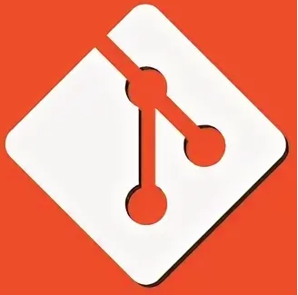

           

<h1 align="center">Hi there! I'm Nikolai!</h1>
<h3 align="right">Programmer student from Russia 🇷🇺</h3>

- 🌱 I’m currently learning Go, web, ...
- 🤔 I’m looking for help with find a course, mentor and some working practice
- 💬 Ask me about any thing you want))

<h3 align="center">My projects</h3>

-<a href="https://github.com/IDontCareMe/LifeTheGame"><b>Life the game<b></a> - classical Conway's Game of Life in JavaScript and HTML5

-No new projects yet.(( :octocat: :new_moon_with_face:

<h3 align="center">My study projects</h3>

-<a href="https://github.com/IDontCareMe/AlgorythmsCourse1">Algorithm course #1</a> - course from Computer Science Center and Stepik.org

<h3 align="center"><a href="https://github.com/IDontCareMe?tab=repositories">All repositories</a></h3>

<h3 align="right">Connect with me:</h3>

           
           

<h1 align="center">Langueges and tools:</h1>

           
           
           

<!--
**IDontCareMe/IDontCareMe** is a ✨ _special_ ✨ repository because its `README.md` (this file) appears on your GitHub profile.

Here are some ideas to get you started:

- 🔭 I’m currently working on ...
- 🌱 I’m currently learning ...
- 👯 I’m looking to collaborate on ...
- 🤔 I’m looking for help with ...
- 💬 Ask me about ...
- 📫 How to reach me: ...
- 😄 Pronouns: ...
- ⚡ Fun fact: ...
-->
